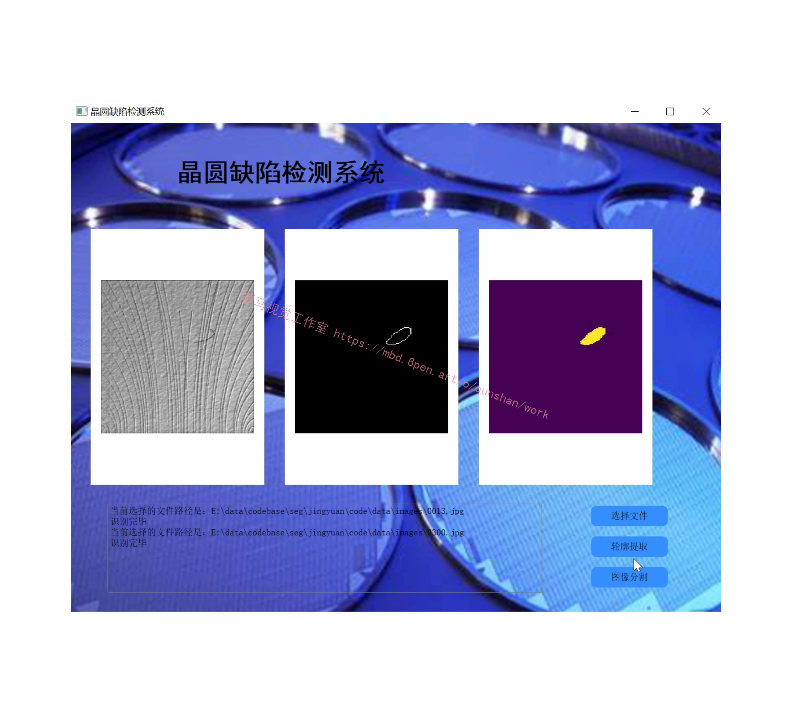
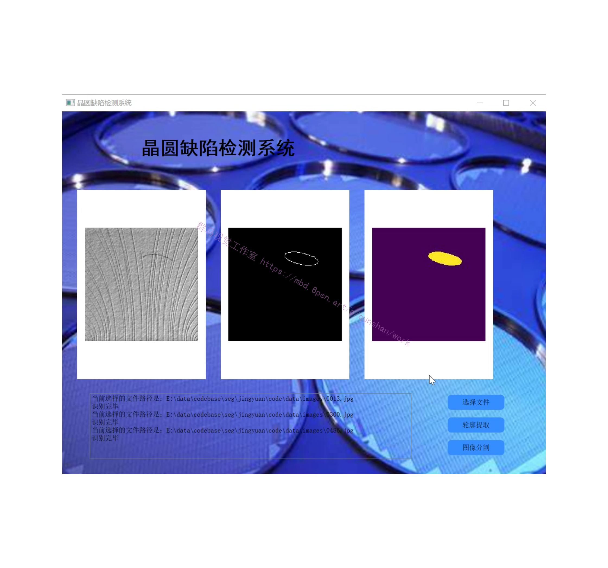
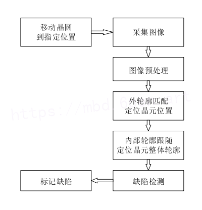
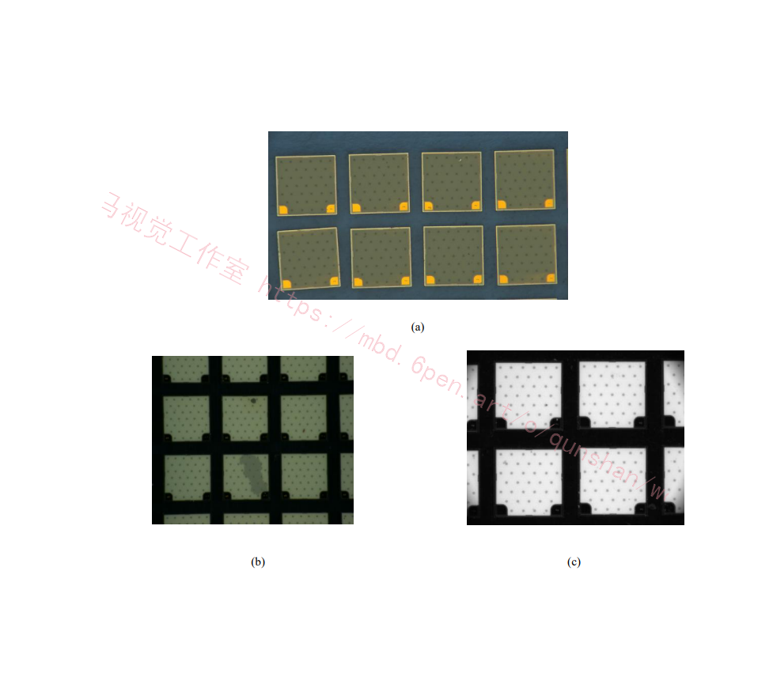
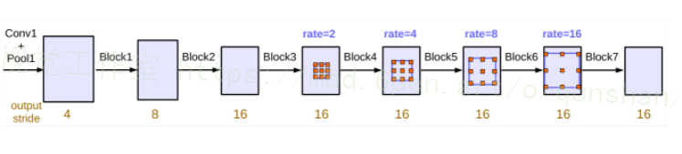
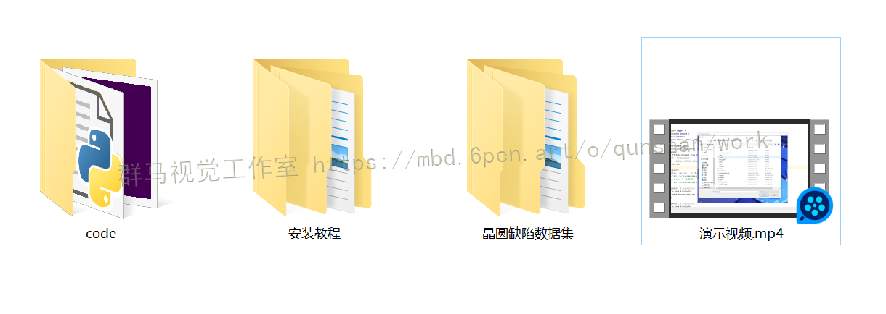

# 1.研究背景
随着半导体行业的迅速发展，半导体晶圆的生产制造需求与日俱增，但是在生产过程中难免会导致晶圆出现各种缺陷，进而影响半导体芯片产品的品质。对于晶圆的质量检测尤为重要，人工检测容易出现误判和速度慢等问题，所以引入基于机器视觉的晶圆表面检测方法成为热点。因此，本文针对基于机器视觉的晶圆表面缺陷检测算法进行研究。

# 2.图片演示

# 3.视频演示
[改进CNN＆FCN的晶圆缺陷分割系统（源码＆教程）_哔哩哔哩_bilibili](https://www.bilibili.com/video/BV1ad4y1176i/?vd_source=bc9aec86d164b67a7004b996143742dc)

# 4.算法流程图

# 5.采集设备的选择
分别采用三种方式对实验样本晶圆成像。第一种方式，采用工业显微相机，加上白色环光，成像分辨率是1920×1080，位深度是24，视野约5.5mm ×3.1mm，成像效果如图(a)所示。第二种方式，采用相机 MER-500-14GM，加上蓝色环光和2倍远心镜头，物距410mm，成像分辨率是2452×2056，位深度是24，视野宽4.4mm，精度2jum，成像效果如图(b)所示。第三种方式，采用相机 Manta G-917B，白色环光LTS-RN12030-W，镜头TY40-110A，物距130mm，成像分辨率是3384×2710，位深度是8，视野宽3mm,精度1 jum，成像效果如图(c)所示。

# 6.传统的基于CNN的分割方法缺点
（更多精品项目，搜索群马视觉工作室）
传统的基于CNN的分割方法：为了对一个像素分类，使用该像素周围的一个图像块作为CNN的输入，用于训练与预测，这种方法主要有几个缺点：
1）存储开销大，例如，对每个像素使用15 * 15的图像块，然后不断滑动窗口，将图像块输入到CNN中进行类别判断，因此，需要的存储空间随滑动窗口的次数和大小急剧上升；
2）效率低下，相邻像素块基本上是重复的，针对每个像素块逐个计算卷积，这种计算有很大程度上的重复；
3）像素块的大小限制了感受区域的大小，通常像素块的大小比整幅图像的大小小很多，只能提取一些局部特征，从而导致分类性能受到限制。
而全卷积网络(FCN)则是从抽象的特征中恢复出每个像素所属的类别。即从图像级别的分类进一步延伸到像素级别的分类。

# 7.改进FCN算法
#### FCN缺点
（1）[该文献得到的结果](https://mbd.pub/o/bread/Y5qUmZ9v)还是不够精细。进行8倍上采样虽然比32倍的效果好了很多，但是上采样的结果还是比较模糊和平滑，对图像中的细节不敏感。
（2）对各个像素进行分类，没有充分考虑像素与像素之间的关系。忽略了在通常的基于像素分类的分割方法中使用的空间规整（spatial regularization）步骤，缺乏空间一致性。

#### HDC（hybrid dilated convolution）代替双线性
res+rpn后就接pooler了，pooler过程有选层操作，那么如果选层不够精细，可能后面分支也不够好，现在对各个分支的更改都是对pooler之后的某一RoI特征进行进一步提取，其实这个RoI已经是认定为“所谓的目标”，那么对目标提来踢去确实可以是关节点“优化”。但是，是不是说或可以对pooler之前的四层都给优化一下呢？那么跟着，rpn也是会优化的 。

针对output_stride=8的情况，rate=2×(6,12,18).并行处理后的特征图在集中通过256个1×1卷积（BN）,最后就是输出了，依旧是1×1卷积。

本文主要提出改进[DUC（dense upsampling convolution）和HDC（hybrid dilated convolution）](https://afdian.net/item?plan_id=5e4efd7a58ed11edb3d952540025c377)，其中DUC相当于用通道数来弥补卷积/池化等操作导致的尺寸的损失，HDC为了消除在连续使用dilation convolution时容易出现的gridding effect。

DUC是可以学习的，它能够捕获和恢复细节的信息，比如，如果一个网络的下采样倍数为16，但是一个物体的长或者宽小于16个像素，下采样之后双线性插值就很难恢复这个物体了。这样最终的label map就会丢失细节信息了。DUC的输出和输入分辨率是一致的，而且可以集成到FCN中，实现端到端的分割。

大部分语义分割模型主要采用双线性插值上采样来获得输出label map。但是双线性插值不是可学习的而且会丢失信息。本文提出了密集上采样卷积(DUC)，来一次性恢复label map的全部分辨率，通过学习一系列上采样滤波器来对下采样的feature map进行恢复到要求的分辨率。

本文首先提出了 dense upsampling convolution，可以捕获和解码更详细的信息，这些细节信息是双线性插值不能获取的；然后提出了一个 dense upsampling convolution框架，可以增加感受视野扩大全局信息，并且解决了网格问题，这是由于标准的空洞卷积造成的。
 

不过光理解卷积和空洞卷积的工作原理还是远远不够的，要充分理解这个概念我们得重新审视卷积本身，并去了解他背后的设计直觉。以下主要讨论 dilated convolution 在语义分割 (semantic segmentation) 的应用。

# 8.系统整合
[下图源码＆环境部署视频教程＆数据集＆自定义UI界面](https://s.xiaocichang.com/s/c97b94)

# 9.参考文献
***
[1]彭昭勇,伍权,陈华伟,等.基于文献计量的机器视觉缺陷检测研究述评[J].计算机工程与应用.2021,(4).DOI:10.3778/j.issn.1002-8331.2009-0476.
[2]明五一,贾豪杰,何文斌,等.透明件表面缺陷的机器视觉检测综述[J].机械科学与技术.2021,(1).DOI:10.13433/j.cnki.1003-8728.20190331.
[3]金映谷,张涛,杨亚宁,等.基于深度学习的产品缺陷检测方法综述[J].大连民族大学学报.2020,(5).
[4]张涛,刘玉婷,杨亚宁,等.基于机器视觉的表面缺陷检测研究综述[J].科学技术与工程.2020,(35).
[5]张缓缓,马金秀,景军锋,等.基于改进的加权中值滤波与K-means聚类的织物缺陷检测[J].纺织学报.2019,(12).DOI:10.13475/j.fzxb.20181200407.
[6]利照坚,江秀娟,朱铮涛,等.基于深度学习的子弹缺陷检测方法[J].组合机床与自动化加工技术.2019,(9).DOI:10.13462/j.cnki.mmtamt.2019.09.025.
[7]汤勃,孔建益,伍世虔.机器视觉表面缺陷检测综述[J].中国图象图形学报.2017,(12).DOI:10.11834/jig.160623.
[8]刘西锋.基于图像处理的晶圆表面缺陷检测[J].通信电源技术.2016,(5).DOI:10.3969/j.issn.1009-3664.2016.05.064.
[9]庞炜涵,张卫民,陈国龙,等.压力容器微泄漏点的非接触超声定位检测研究[J].仪表技术与传感器.2016,(2).DOI:10.3969/j.issn.1002-1841.2016.02.019.
[10]杨巨成,刘娜,房珊珊,等.基于深度学习的人脸识别方法研究综述[J].天津科技大学学报.2016,(6).DOI:10.13364/j.issn.1672-6510.20160050.

---
#### 如果您需要更详细的【源码和环境部署教程】，除了通过【系统整合】小节的链接获取之外，还可以通过邮箱以下途径获取:
#### 1.请先在GitHub上为该项目点赞（Star），编辑一封邮件，附上点赞的截图、项目的中文描述概述（About）以及您的用途需求，发送到我们的邮箱
#### sharecode@yeah.net
#### 2.我们收到邮件后会定期根据邮件的接收顺序将【完整源码和环境部署教程】发送到您的邮箱。
#### 【免责声明】本文来源于用户投稿，如果侵犯任何第三方的合法权益，可通过邮箱联系删除。